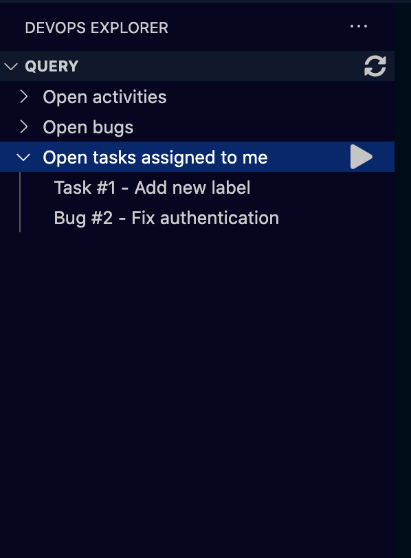
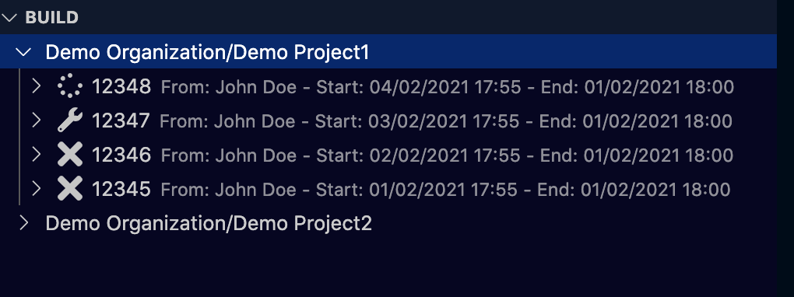

# Azure DevOps Explorer
Thank you for downloading this extension! It will help you browse your favourite Azure DevOps queries and builds without leaving your favourite code editor!

In order to do this, it uses **official API**, and uses Azure DevOps Personal Access Token (*PAT*) for user identity.

## Screenshots

Saved queries appear in a side panel and you can run them clicking on the play button or quick display them opening the tree view

Saved projects appear in a separate side panel and you can always see the last builds by refreshing the view
- tick: build completed
- cross: build failed
- wrench: build in progress
- spinner: waiting for build

## Setup
First, you have to request a Personal Access Token on Azure DevOps giving **read** permissions on Work Item and Buid.
Then follow the configuration guide to set everything up.